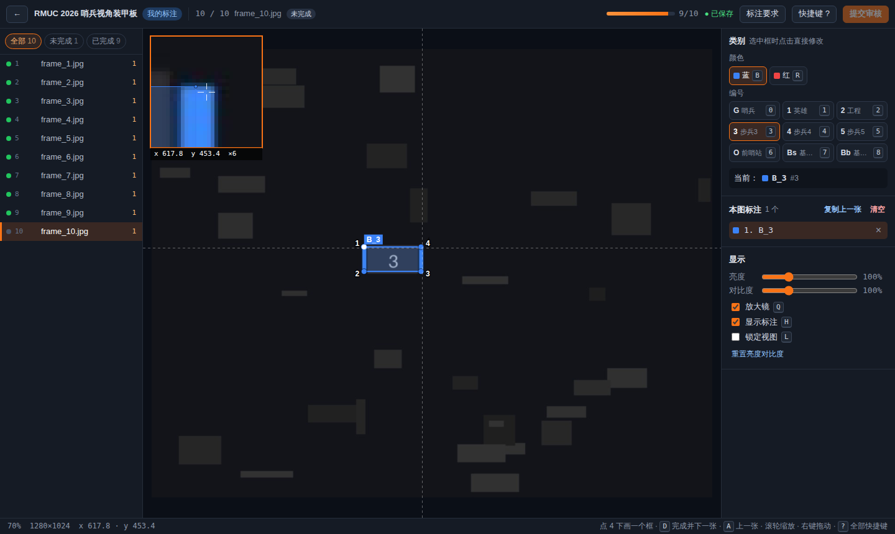
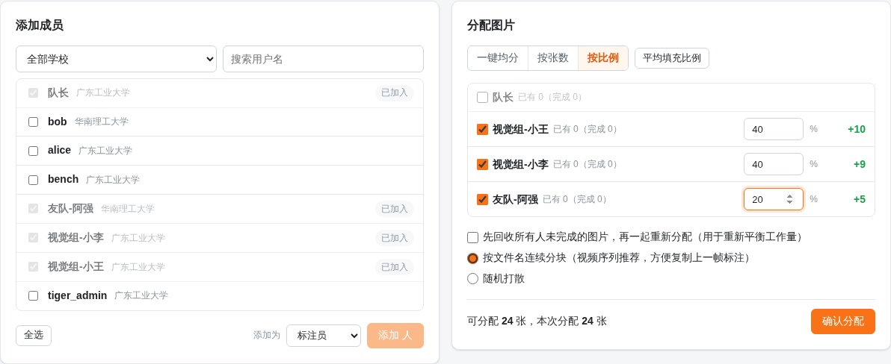
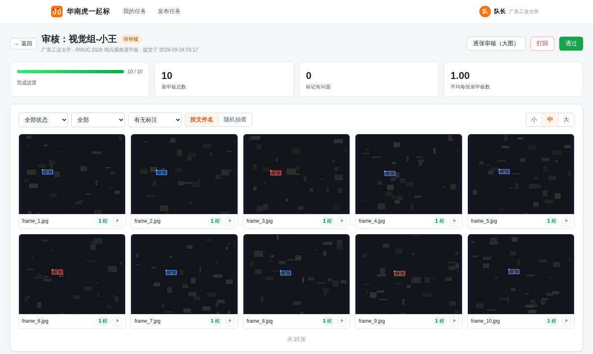

# 华南虎一起标 · TigerCali

面向 RoboMaster 战队的**多人协同装甲板四点标注平台**：注册即用，跨学校拉人，按张数 / 比例 / 一键均分派活，标注—提交—审核闭环，最后一键导出 YOLO 数据集直接训练。



## 功能一览

| | |
| --- | --- |
| **账号** | 自助注册：用户名 + 密码 + 学校；学校可从已有列表选择，方便按学校找人 |
| **发布任务** | 任何人都可以发布任务并成为管理员；Markdown 写标注要求（可直接粘贴示例截图），所有标注员可见 |
| **类别** | 装甲板模式：颜色（蓝/红/灰/紫）× 编号（哨兵/1~5/前哨站/基地小/基地大）自由勾选；也支持自定义类别。改类别后已有标注自动重新编号 |
| **上传** | 拖拽图片 / 整个文件夹 / zip；按内容哈希自动去重；按文件名自然排序（frame2 在 frame10 前）；带同名 `.txt` 时自动导入为**预标注** |
| **成员** | 按「本校 / 全部学校 / 指定学校」搜索用户加入任务；可设为标注员或管理员 |
| **分配** | 一键均分 / 按张数 / 按百分比；连续分块（视频序列友好）或随机打散；可先回收所有未完成图片再重新平衡 |
| **标注** | Canvas 标注器：4 次单击成框、放大镜 + 十字准星、拖点 / 整体拖动、方向键亚像素微调、自动规范点序、复制上一帧、亮度对比度、撤销重做，全键盘操作 |
| **提交** | 全部完成后提交审核；审核前可撤回 |
| **审核** | 缩略图网格叠加标注快速浏览、随机抽查、逐张大图审核（可直接修改）、逐张标记问题并写说明；通过 / 打回（被标记的图变成「需返工」） |
| **结束** | 全部图片完成且所有标注员审核通过后任务**自动结束**，也可手动结束 / 重新开启 |
| **导出** | YOLO Pose（Ultralytics 关键点）/ RM 四点 / 颜色+编号双标签 / YOLO 检测框 / JSON；可选点序、验证集比例、是否含图片与空图；流式打包下载 |

## 快速开始

### 方式一：Docker（推荐）

```bash
git clone <本仓库> tigercali && cd tigercali
docker compose up -d --build
# 打开 http://服务器IP:8000 ，注册账号即可使用
```

数据（SQLite 数据库、原图、缩略图）全部在 `./data`。备份时先停服务再复制整个目录；不想停服务的话，用 SQLite 的在线备份导出数据库，图片目录直接复制：

```bash
sqlite3 data/tigercali.db ".backup 'backup/tigercali.db'"
rsync -a data/images data/thumbs data/attachments backup/
```

### 方式二：直接运行

需要 Python ≥ 3.10、Node.js ≥ 20。

```bash
# 1. 构建前端
cd frontend
npm ci
npm run build          # 产物在 frontend/dist，后端会自动托管

# 2. 启动后端
cd ../backend
pip install -r requirements.txt
python -m app          # 默认 0.0.0.0:8000，数据目录 ../data
```

## 使用流程

| 分配图片 | 审核 |
| --- | --- |
|  |  |

**管理员**

1. 右上角「发布任务」→ 填名称、标注要求、勾选类别 → 创建。
2. 「图片」页拖入图片 / 文件夹 / zip。已有模型的话，把推理结果 `.txt` 一起拖进来（或用「导入预标注」），标注员只需修正。
3. 「成员与分配」页搜索并添加队员，选择一键均分 / 按张数 / 按比例，确认分配。
4. 「概览」页实时看每个人的进度、今日完成量。
5. 有人提交后「审核」页出现待审核：网格快速过一遍（可随机抽查），有问题的点 ⚑ 标记并写说明，然后「通过」或「打回」。
6. 「导出」页选择格式下载 zip，直接训练。

**标注员**

1. 首页「我的标注」进入任务，先看标注要求。
2. 「开始标注」进入工作台：依次点击装甲板 4 个角点完成一个框，没有装甲板直接按 `D`。
3. 全部完成后点「提交审核」；被打回时点「只看需返工的」逐张修改后重新提交。

## 标注工作台快捷键

| 按键 | 作用 |
| --- | --- |
| 左键单击 ×4 | 依次点 4 个点完成一个装甲板（白色实心点 = 第 1 点 / 左上） |
| 拖动点 / 框内拖动 | 调整角点 / 整体移动；`Ctrl`+单击 在已有框内强制新建 |
| 滚轮 | 以鼠标为中心缩放 |
| 右键 / 中键拖动、`空格`+拖动 | 平移 |
| `D` / `PageDown` | **确认完成并下一张**（空图也按 D） |
| `A` / `PageUp` | 上一张 |
| `Shift`+`D` | 跳到下一张未完成 |
| `C` | 复制上一张的标注（视频序列逐帧微调，效率翻倍） |
| `B` `R` `N` `P` | 颜色：蓝 / 红 / 灰 / 紫（选中框时直接改它） |
| `0`~`8` | 编号：0 哨兵、1~5、6 前哨站、7 基地小、8 基地大 |
| 方向键 | 微调选中点 1 像素（`Shift` 精调 0.2 像素）；未选中点时平移整个框 |
| `Tab` | 在框之间切换选择 |
| `Delete` / `Backspace` | 删除选中的框；画到一半时撤回上一个点 |
| `Ctrl`+`Z` / `Ctrl`+`Shift`+`Z` | 撤销 / 重做 |
| `F` / `H` / `Q` / `L` | 适应窗口 / 隐藏标注 / 放大镜 / 锁定视图 |
| `X` | 审核模式下标记 / 取消标记有问题 |
| `?` | 快捷键帮助 |

所有修改 0.6 秒内自动保存；同一张图在两处同时修改时以版本号检测冲突，不会互相覆盖。

## 导出格式

每张图片一个同名 `.txt`，每行一个装甲板，坐标归一化到 0~1：

| 格式 | 每行内容 |
| --- | --- |
| YOLO Pose（推荐） | `cls cx cy w h x1 y1 x2 y2 x3 y3 x4 y4` |
| RM 四点 | `cls x1 y1 x2 y2 x3 y3 x4 y4` |
| 颜色 + 编号双标签 | `color tag x1 y1 x2 y2 x3 y3 x4 y4`（color：0 蓝 1 红 2 灰 3 紫；tag：0 哨兵 1~5 6 前哨站 7 基地小 8 基地大） |
| YOLO 检测框 | `cls cx cy w h`（由四点外接矩形得到） |
| JSON | 像素坐标原始标注，便于备份 / 二次处理 |

- 默认点序 **左上 → 左下 → 右下 → 右上**，导出时可改成顺时针等其他顺序。
- 装甲板模式下 `class id = 颜色序号 × 编号数 + 编号序号`（按勾选的颜色、编号排列），完整对照见导出包里的 `data.yaml` / `classes.txt` / `README.txt`。
- 导出包结构：

  ```
  data.yaml  classes.txt  README.txt
  images/train/*.jpg   images/val/*.jpg
  labels/train/*.txt   labels/val/*.txt
  ```

用 Ultralytics 训练 YOLO Pose（`data.yaml` 已写好 `kpt_shape: [4, 2]` 和 `flip_idx`）：

```bash
yolo pose train data=data.yaml model=yolo11n-pose.pt imgsz=640 fliplr=0.0
```

> 数字左右翻转后含义会变，建议关闭水平翻转增强 `fliplr=0.0`。

## 预标注导入

在「图片」页上传时带上 `.txt`，或使用「导入预标注」：按文件名匹配图片（`a.txt` ↔ `a.jpg`，同名文件优先匹配 `labels/xxx ↔ images/xxx` 目录结构），自动识别 RM 四点（9 个数）/ 双标签（10 个数）/ YOLO Pose（13 或 17 个数）格式，归一化坐标和像素坐标均可。默认只填充还没有标注的图片。

## 配置

全部通过环境变量设置：

| 变量 | 默认值 | 说明 |
| --- | --- | --- |
| `TIGERCALI_DATA_DIR` | `./data` | 数据目录（数据库、图片、缩略图、附件） |
| `TIGERCALI_DATABASE_URL` | `sqlite:///<DATA_DIR>/tigercali.db` | 也可以换成 PostgreSQL 等 SQLAlchemy 支持的数据库 |
| `TIGERCALI_INVITE_CODE` | 空 | 设置后注册需要邀请码，**公网部署强烈建议设置** |
| `TIGERCALI_SECURE_COOKIE` | `0` | 通过 HTTPS 访问时设为 `1` |
| `TIGERCALI_HOST` / `TIGERCALI_PORT` | `0.0.0.0` / `8000` | 监听地址 |
| `TIGERCALI_WORKERS` | `1` | uvicorn 进程数 |
| `TIGERCALI_SESSION_DAYS` | `30` | 登录有效期（天） |
| `TIGERCALI_MAX_IMAGE_MB` | `64` | 单张图片大小上限 |
| `TIGERCALI_UPLOAD_WORKERS` | CPU 核数（≤8） | 上传时并行生成缩略图的线程数 |

### 放在 Nginx 后面

```nginx
server {
    listen 443 ssl;
    server_name label.example.com;
    client_max_body_size 4g;          # 允许上传大 zip
    proxy_request_buffering off;      # 大文件边传边转发
    proxy_buffering off;              # 导出 zip 边打包边下载
    location / {
        proxy_pass http://127.0.0.1:8000;
        proxy_set_header Host $host;
        proxy_set_header X-Forwarded-For $proxy_add_x_forwarded_for;
        proxy_set_header X-Forwarded-Proto $scheme;
    }
}
```

## 性能设计

- **翻页零等待**：前端预取后 4 张 + 前 1 张，图片解码成 `ImageBitmap` 放进 LRU 缓存；图片接口带 `immutable` 缓存头，回看不再下载。
- **画布只在需要时重绘**：所有交互合并到一次 `requestAnimationFrame`；列表虚拟滚动，几万张图也只渲染可见的几十行。
- **自动保存不阻塞操作**：每张图一个保存队列 + 版本号乐观锁，切图、连按 `D` 都不用等网络。
- **上传快**：浏览器 3 路并发分批上传，服务端线程池并行校验 + 生成缩略图（JPEG 直接按比例缩放解码）。
- **数据库**：SQLite WAL 模式，读写并发；按 `(任务, 标注员, 状态)` 建索引，统计与分配都是单条聚合 / 批量更新。
- **导出流式打包**：边读边写 zip 边下载，图片不再压缩（直接存储），标签文本压缩。

在一台 4 核的开发机上实测（1280×1024 JPEG，3000 张）：上传约 340 张/秒（含缩略图），3000 张图的列表接口约 20 ms（gzip 后 16 KB），单次保存标注约 4 ms，带图导出约 58 MB/s，工作台打开 3000 张图的任务约 0.2 s。

## 开发

```bash
# 后端（热重载）
cd backend && pip install -r requirements-dev.txt
uvicorn app.main:app --reload --port 8000

# 前端（Vite 开发服务器，/api 自动代理到 8000）
cd frontend && npm install && npm run dev

# 测试
cd backend && python -m pytest -q tests
cd frontend && npm run build        # 含 vue-tsc 类型检查
```

目录结构：

```
backend/app/
  main.py          应用入口、静态文件、gzip
  models.py        数据表：用户 / 任务 / 成员 / 图片（标注存 JSON）
  labels.py        类别展开、点序、各种 YOLO 格式读写
  storage.py       图片落盘、缩略图
  routers/         auth / tasks / members（分配、审核）/ images（上传、标注）/ export
frontend/src/
  annotator/       画布标注引擎（editor.ts）、几何工具、图片缓存
  views/           登录注册、首页、建任务、任务页、标注工作台、审核
  task/            任务页各个标签页
```
